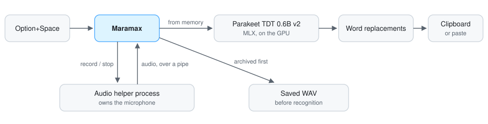

# Maramax

On-device dictation for Apple Silicon Macs. Press **Option+Space**, speak, press
it again: NVIDIA's Parakeet model transcribes on the GPU through MLX, and the
text is copied, or pasted into the app you were using. No audio or text leaves
the Mac.

<picture>
  <source media="(prefers-color-scheme: dark)" srcset="docs/images/dictation-dark.gif">
  
</picture>

**[Download for Apple Silicon](https://github.com/maxim-golubev/maramax/releases/latest)** · [User guide](docs/guide.md) · [Architecture](docs/architecture.md) · [What was measured](docs/validation.md)

- **Fast:** on an M3 Pro, a dictation under 30 seconds is transcribed in about
  0.3 s and one over two minutes in about 3 s (medians over 20 real dictations).
- **Private:** recognition, history, and recordings stay on the Mac; the only
  network request it makes by itself is a daily update check.
- **Built with:** Python 3.12, PyObjC/AppKit for the native interface, MLX for
  inference, PortAudio in a separate helper process, Carbon hotkeys through
  ctypes, py2app. About 8,000 lines of code and 4,000 of tests; macOS 15.

## Engineering problems

A speech model is the easy part. Most of the work went into these:

- **Bluetooth audio drivers hang.** A call into the macOS audio stack can block
  forever while AirPods switch modes, so the app never makes one: a helper
  process owns the microphone, every start and stop has a deadline, and a
  helper that stops answering is replaced without losing the audio it already
  sent. In Automatic mode a microphone that disappears mid-sentence is swapped
  for the next one. (Exercised with a fake audio device driving the real
  helper; live AirPods failover is on the hardware checklist.)
- **No dictation is ever lost.** Audio is written to disk as it arrives and
  archived before recognition starts, so neither a crash nor a failed
  transcription can cost a recording.
- **The model sometimes stops punctuating.** In long dictations Parakeet can
  write a stretch in lower case with no punctuation. Experiments on real
  recordings traced it to where the encoder's audio window starts, not to the
  decoder, so Maramax finds those stretches, transcribes them again in shorter
  windows, and splices them back only if the wording still matches (at least
  90 % of the words).
- **Updates are signed and small.** An update is accepted only with Maramax's
  own release signature, downloads only the files that changed, rebuilds the
  app from a copy of the installed one, and proves the result exact with that
  signature before swapping it in. The previous version is kept.

Over 300 tests run without a microphone, a screen, or model weights: a fake
audio device drives the real helper process, the native windows are built and
measured off-screen, and the update swap script runs against temporary folders.

<picture>
  <source media="(prefers-color-scheme: dark)" srcset="docs/images/how-it-works-dark.svg">
  
</picture>

## Install

1. Download `Maramax-<version>.zip` from
   [Releases](https://github.com/maxim-golubev/maramax/releases/latest), unzip
   it, and move `Maramax.app` to Applications.
2. Open it. It is signed with the project's own certificate but not notarized
   by Apple, so the first time macOS blocks it: open **System Settings →
   Privacy & Security** and choose **Open Anyway**.
3. The first launch downloads the speech model (2.5 GB). After that Maramax
   starts in a few seconds and works offline, and keeps itself up to date.

Allow microphone access when asked; turn on Accessibility only if you want the
text pasted for you. Also there: your own replacement list for names and jargon
it mishears, an optional larger recognizer (Qwen3-ASR 1.7B) that takes that list
as vocabulary, and batch transcription of audio and video files.

## Build from source

Requires Python 3.12 and Homebrew's PortAudio (FFmpeg only for importing media files).

```sh
brew install portaudio ffmpeg
uv sync --extra dev
./run.sh                                  # run from source
.venv/bin/python -m pytest -q             # tests
bash build_app.sh                         # dist/Maramax.app, checked before it is kept
```

## Credits

Maramax started as a fork of Osada Paranaliyanage's
[parakeet-dictation](https://github.com/osadalakmal/parakeet-dictation), itself
built on Ashwin P Chandran's
[whisper-dictation](https://github.com/ashwin-pc/whisper-dictation). It has
since been rewritten: `git blame` attributes 53 of its roughly 8,800 lines to
the earlier projects. Recognition uses NVIDIA's Parakeet TDT 0.6B v2 through
[parakeet-mlx](https://github.com/senstella/parakeet-mlx), and optionally
Qwen3-ASR through [qwen3-asr-mlx](https://github.com/gabrimatic/qwen3-asr-mlx).
MIT licensed.
