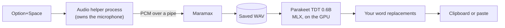

# Maramax

Dictation for the Mac that never leaves the Mac.

Press **Option+Space**, talk, press it again. The text lands on your clipboard,
or is typed straight into the app you were using. Speech recognition runs on
your Mac's GPU with NVIDIA's Parakeet model; no audio or text is sent anywhere.

<picture>
  <source media="(prefers-color-scheme: dark)" srcset="docs/images/bar-dark.png">
  
</picture>

**[Download for Apple Silicon](https://github.com/maxim-golubev/maramax/releases/latest)** · [User guide](docs/guide.md) · [How it was tested](docs/validation.md)

## What it's like to use

- **Fast.** On an M3 Pro a 20-second dictation is transcribed in about a third
  of a second, and a four-minute one in under four.
- **Out of the way.** A small bar shows the microphone, the time, and a live
  level meter without taking focus from the app you are typing in.
- **It doesn't lose what you said.** Every recording is saved before it is
  transcribed, so a crash, a stuck Bluetooth driver, or a failed transcription
  still leaves the audio to play back or retry.
- **It learns your words.** Tell it how names and jargon it keeps mishearing
  should be spelled.
- **It keeps itself current.** Once a day it checks for a new version and
  installs it when you say so.

Also there if you want them: a second, larger recognizer (Qwen3-ASR 1.7B) that
is better with unusual names, and batch transcription of audio and video files.

## Install

1. Download `Maramax-<version>.zip` from
   [Releases](https://github.com/maxim-golubev/maramax/releases/latest) and unzip it.
2. Move `Maramax.app` to Applications and open it. It is signed for local use,
   not notarized by Apple, so the first time macOS will refuse; open
   **System Settings → Privacy & Security** and choose **Open Anyway**.
3. The first launch downloads the speech model (2.5 GB). After that Maramax
   starts in a few seconds and works offline.

Requires a Mac with Apple Silicon. Allow microphone access when asked; turn on
Accessibility only if you want results typed for you.

## How it works



A speech model is the easy part. Most of the work went into these:

- **Bluetooth audio drivers hang.** On macOS a call into the audio library can
  block forever while AirPods switch modes. So the app never touches the driver
  itself: a helper process owns the microphone, every start and stop has a
  deadline, and a helper that stops answering is replaced while the audio it
  already sent is kept. In Automatic mode, a microphone that disappears
  mid-sentence is swapped for the next one and the recording carries on.
- **Audio is saved first.** Captured audio is written to disk as it arrives and
  archived before recognition starts, so nothing the model does can cost you a
  recording.
- **The model sometimes stops punctuating.** In long dictations Parakeet
  occasionally writes a stretch entirely in lower case with no punctuation.
  Tests on real recordings showed it depends on exactly where the audio window
  starts, not on the decoder, so Maramax finds those stretches, transcribes
  them again in shorter windows, and stitches the result back in, leaving every
  transcript that was already fine unchanged.
- **Long recordings stay in memory.** Dictations of any length are recognized
  straight from memory in overlapping two-minute chunks, merged on the words
  they share. No temporary files, no FFmpeg.
- **Updates check who made them.** A new version is installed only if it is
  signed with Maramax's own release certificate, which exists on one machine;
  it is swapped in after the app quits, and the previous version is kept for
  rollback.

The app is about 7,400 lines of Python (PyObjC for the native interface, MLX
for inference) with about 300 tests that need no microphone, screen, or model
weights: a fake audio device drives the real helper process, and the native
windows are built and measured off-screen.

## Build from source

Requires Python 3.12 and Homebrew's PortAudio (FFmpeg only for importing media files).

```sh
brew install portaudio ffmpeg
uv sync --extra dev
./run.sh                                  # run from source
.venv/bin/python -m pytest -q             # tests
bash build_app.sh                         # dist/Maramax.app, checked before it is kept
```

## Credits

Maramax began as a fork of Osada Paranaliyanage's
[parakeet-dictation](https://github.com/osadalakmal/parakeet-dictation), itself
built on Ashwin P Chandran's
[whisper-dictation](https://github.com/ashwin-pc/whisper-dictation). It has
since been rewritten: all but a few dozen of its current lines are new.
Recognition uses NVIDIA's Parakeet TDT 0.6B v2 through
[parakeet-mlx](https://github.com/senstella/parakeet-mlx), and optionally
Qwen3-ASR through [qwen3-asr-mlx](https://github.com/gabrimatic/qwen3-asr-mlx).
MIT licensed.
